# Art guide

Sunroot's map is drawn with hand-made art: warm storybook papercraft, one image per tile type and
building, with winter versions, homes' lit windows at night, and turning blades and wheels. Anything
without a file falls back to its procedural drawing (`src/render/tileArt.ts`,
`src/render/buildingArt.ts`), so the game and its tests never depend on art files.

The design doc kept art procedural "until the slice is fun" and left "when to commission hand-made
art" open ([DESIGN.md](DESIGN.md), Working rules); that question is answered (DECISIONS.md, Hand-made
art).

## How art gets into the game

1. **Delivered** to [`art/incoming/`](../art/incoming/): the full-size originals, as made, with
   their own [README](../art/incoming/README.md) and `manifest.json` (geometry, rotor pivots,
   hashes). These are the source of truth; the game doesn't load them.
2. **Imported** with `npx tsx scripts/import-art.ts` into `src/art/`, which the game loads: every
   frame at half size (256 × 320; the tile stays 200 px across, four times its 50 px in the game),
   the lit windows alone (`id.windows.png`, the difference between `id.lit.png` and the day
   sprite), a square icon per building for the interface, and `art.json` (the frame's geometry,
   the rotors' pivots, and which buildings carry their own tile). Run it again whenever
   `art/incoming/` changes, and commit both.
3. **Drawn** by `src/render/sprites.ts` and the map: tiles and own-tile buildings row by row (each
   row covers the side band of the row behind), other buildings over them, rotors turning on top,
   winter art in winter, lit windows glowing over the night as each season plays out.

## Style

- **Sunlit papercraft, as a diorama.** The world is cut paper ([DESIGN.md](DESIGN.md), Look,
  feel and sound): flat, matte shapes in layers. The 3D element is the layering: give each layer a
  paper thickness (a darker edge 2 to 6 px at delivery size), let layers stand up from the tile
  like a pop-up book, and shade with soft contact shadows where layers meet. No glossy
  highlights, no hard black outlines, no photographic texture. A faint paper grain is welcome.
- **Light from the upper left**, soft and high (late morning). Bake only contact shadows and
  shading on the object itself. Don't bake long cast shadows across the tile: the game draws
  moving shadows as the sun crosses each season, and shade is a rule (tall buildings dim solar).
- **Neutral season, plus winter.** The main art is late spring to summer; each tile and
  building also has a winter version. Spring and autumn use the summer art.
- **Readable small.** The map zooms from half to 2.5 times game size, so a tile can be as small as
  25 px across. Each building needs a silhouette and main colour of its own at that size;
  details under 4 px at delivery size disappear. The interface also shows each building as a
  48 px icon.
- **Evolutions echo their origin.** Each evolved building should be recognisably the building it
  came from, changed (see the table).
- **Colour.** The palette below is the procedural art's, which still draws anything without a file
  (and the map's marks and highlights). Don't carry meaning by colour alone.

| Swatch            | Hex                   | Used for                               | Source                  |
| ----------------- | --------------------- | -------------------------------------- | ----------------------- |
| Paper             | `#f4ebd6`             | Background, the gaps between tiles     | `src/render/palette.ts` |
| Ink               | `#2f3b2e`             | Dark details, shadows (at low opacity) | `src/render/palette.ts` |
| Sun gold          | `#f2c14e`             | Light, highlights, flags               | `src/render/palette.ts` |
| Leading gold      | `#d9a441`             | Gold edges                             | `src/render/palette.ts` |
| Terracotta        | `#d98c5f`             | Roofs                                  | `src/render/palette.ts` |
| Wall              | `#f3dfbd`             | Walls                                  | `src/render/palette.ts` |
| Wood              | `#a0643f`             | Timber, trunks                         | `src/render/palette.ts` |
| Stone             | `#9e9280`             | Stone, ruins                           | `src/render/palette.ts` |
| Tree dark / light | `#4a6e43` / `#5e8a55` | Foliage                                | `src/render/palette.ts` |
| Solar teal        | `#2f5e63`             | Solar panels                           | `src/render/palette.ts` |
| Water             | `#9ccfc9`             | Ponds                                  | `src/render/palette.ts` |
| Field / furrow    | `#e6cf73` / `#b89b3e` | Crops                                  | `src/render/palette.ts` |
| Fruit / flower    | `#d9543c` / `#e58fa8` | Fruit, flowers                         | `src/render/palette.ts` |

Each tile type's top and side colours are in `TILE_COLORS` in the same file.

## Geometry

The map is a grid of pointy-top hexes seen from above, a little flatter than regular ones to match
the art: the slanted edges keep their 30° slope and the straight sides are 45% of the tile's width.
Depth shows as a paper side band below each tile, and things with height rise straight up the
screen.

| Measure                       | In the delivered art             | In the game                               | Source                   |
| ----------------------------- | -------------------------------- | ----------------------------------------- | ------------------------ |
| Frame                         | 512 × 640 px                     | 64 × 80 (an eighth of the art)            | `art/incoming/README.md` |
| Tile width                    | 400 px                           | 50.2 (`HEX_RADIUS` 29 × √3)               | `src/render/layout.ts`   |
| Tile centre (on its top face) | (256, 373.5)                     | each hex's centre                         | `art/incoming/README.md` |
| Top vertex                    | (256, 168)                       |                                           | `art/incoming/README.md` |
| Straight sides                | 180 px (45% of the width)        | `SIDE_FACTOR` 0.78 of a regular hexagon's | `src/render/layout.ts`   |
| Paper side band               | 32 px                            | `TILE_DEPTH` 4                            | `src/render/layout.ts`   |
| Building bases                | near y 440 (crop plots to y 545) |                                           | `art/incoming/README.md` |

Tiles sit 30 px apart (centre to corner) and are drawn 29 across, so a paper gap shows between them.

## Files

- **Names are the ids** in the tables below (camelCase): `meadow.png`, `windSpire.png`.
- **Tiles:** two summer variants (`id.png`, `id-2.png`; the game picks one per tile, the same every
  time) and a winter version (`id.winter.png`).
- **Buildings:** `id.png` and `id.winter.png`. Most come without ground and stand on the tile under
  them. Wind Spire, Pumped Reservoir, Salvage Yard, Rewilded Ruin and Weir carry their own tile
  (the only kind they're built on) and take its place; the importer finds them by their filled-in
  side band. Floodplain Farm and Agrivoltaic Field are crop plots laid over their tile.
- **Night:** Founders' Camp, Cottage and Treehouse Commons have `id.lit.png`, the same frame with
  lit windows.
- **Rotors:** `windSpire.rotor.png` and `riverWheel.rotor.png` (and winter versions), drawn over
  the base and turned about the pivot given in `manifest.json`.
- **What the game draws over the art:** smoke, bees, butterflies, fish and other life; silt,
  damage and blackout veils; the map's marks and highlights; the placement ghost (the same art,
  faded); the season's events; night.

## Tile types

| Tile       | Id           | What it is in play                                                                                          | Current art                                                            | Source                                       |
| ---------- | ------------ | ----------------------------------------------------------------------------------------------------------- | ---------------------------------------------------------------------- | -------------------------------------------- |
| River      | `river`      | Water. Weirs go on it; river wheels go beside it. Floods spread from it. The current line is drawn by code. | 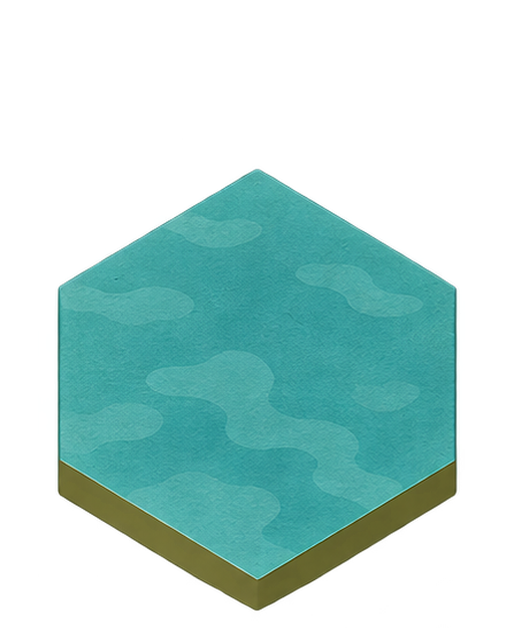           | `src/sim/content/schema.ts`, `art/incoming/` |
| Reservoir  | `reservoir`  | Still water a weir backs up (3 tiles upstream). Turns back into river if the weir goes.                     | 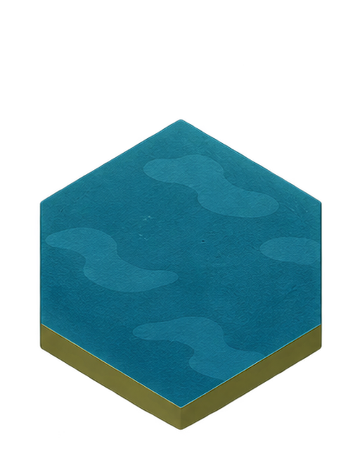   | `src/sim/content/schema.ts`, `art/incoming/` |
| Floodplain | `floodplain` | Fertile, floods in spring. Farms gain silt; other buildings get damaged unless a levee is near.             | 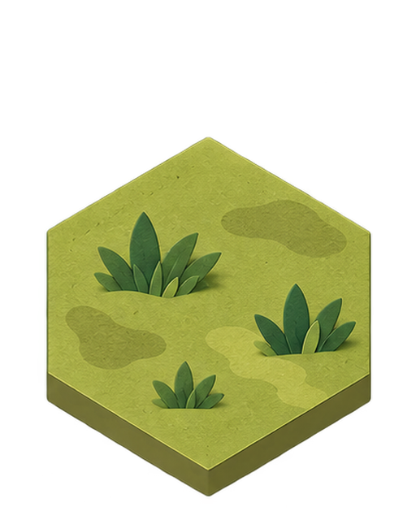 | `src/sim/content/schema.ts`, `art/incoming/` |
| Hill       | `hill`       | Wind spires and pumped reservoirs go here. Buildings on hills are exposed to storms.                        | 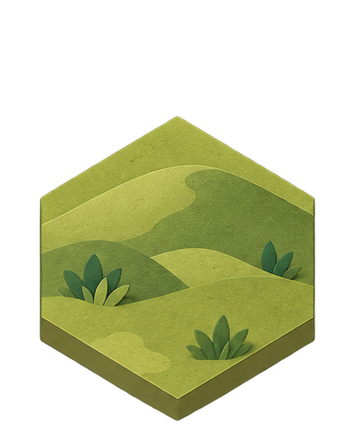             | `src/sim/content/schema.ts`, `art/incoming/` |
| Ruin       | `ruin`       | Old town remains holding salvage. Salvage yards go here.                                                    | 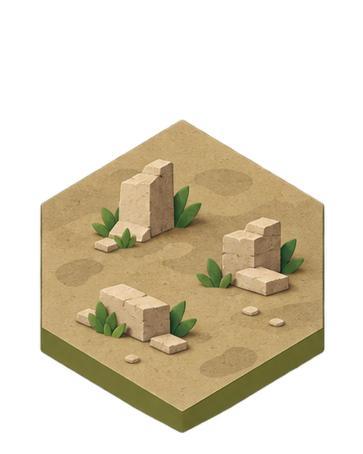             | `src/sim/content/schema.ts`, `art/incoming/` |
| Barren     | `barren`     | Worn-out land; bottom of the healing ladder.                                                                | 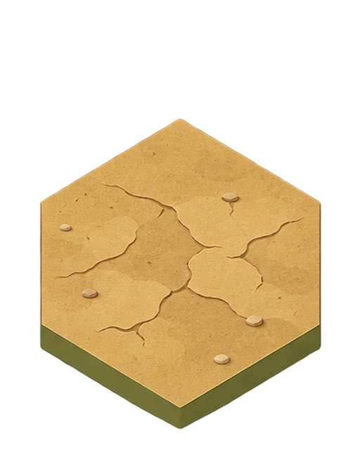         | `src/sim/content/schema.ts`, `art/incoming/` |
| Scrub      | `scrub`      | Recovering land; second step of the healing ladder.                                                         | 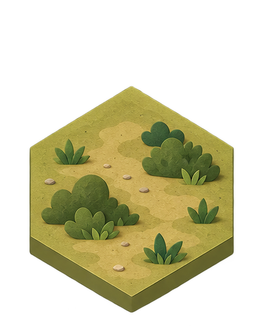           | `src/sim/content/schema.ts`, `art/incoming/` |
| Meadow     | `meadow`     | Healthy land; third step. Adds Harmony.                                                                     | 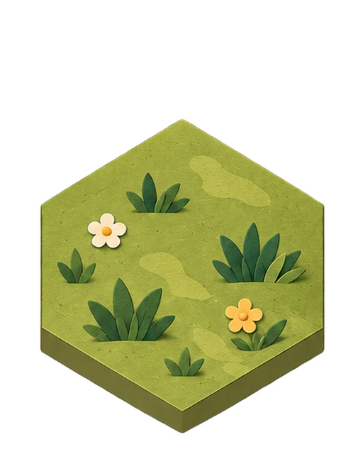         | `src/sim/content/schema.ts`, `art/incoming/` |
| Woodland   | `woodland`   | Healthiest land; top step. Casts shade; shelters buildings from storms.                                     | 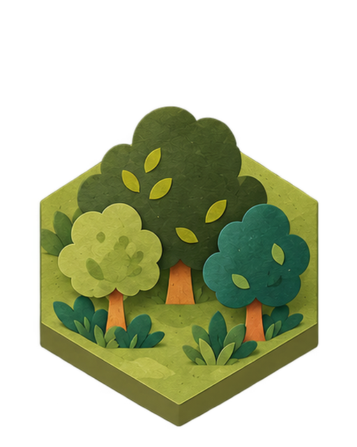     | `src/sim/content/schema.ts`, `art/incoming/` |

Healing ladder: barren → scrub → meadow → woodland. Tiles step up it as the land heals, so these
four should read as one land getting healthier.

## Buildings

| Building                | Id                      | Kind     | Placed on                           | Art notes                                                                          | Current art                                                                                    | Source                                           |
| ----------------------- | ----------------------- | -------- | ----------------------------------- | ---------------------------------------------------------------------------------- | ---------------------------------------------------------------------------------------------- | ------------------------------------------------ |
| Founders' Camp          | `foundersCamp`          | Home     | Land except floodplain              | Where every run starts; a camp with a flag. Lit at night.                          | 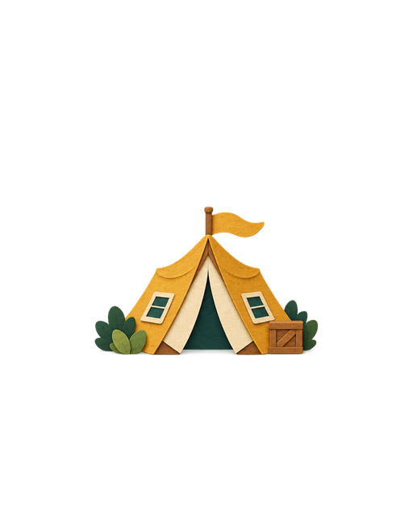                   | `src/content/willow-reach.json`, `art/incoming/` |
| Floodplain Farm         | `floodplainFarm`        | Food     | Floodplain, Meadow                  | Ground cover: fills the footprint. Survives floods; silt is drawn over it by code. | 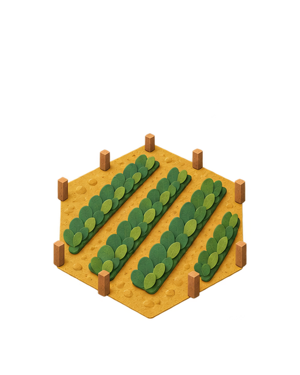                | `src/content/willow-reach.json`, `art/incoming/` |
| Orchard                 | `orchard`               | Food     | Land except floodplain              | Fruit trees; takes seasons to mature.                                              | 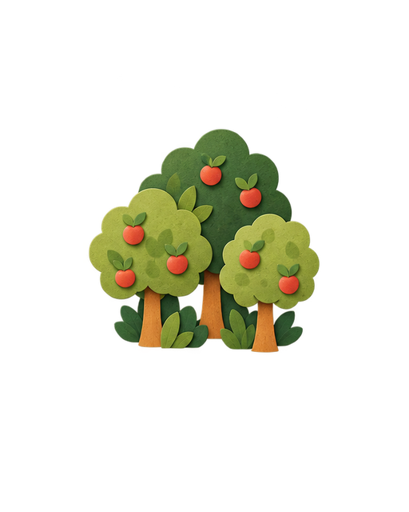                               | `src/content/willow-reach.json`, `art/incoming/` |
| Apiary                  | `apiary`                | Food     | Any land                            | Hives; bees are animated by code.                                                  | 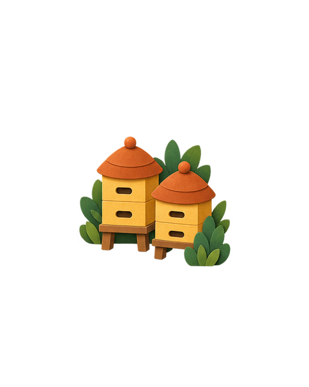                                 | `src/content/willow-reach.json`, `art/incoming/` |
| Fish Pond               | `fishPond`              | Food     | Any land                            | Ground cover: water fills most of the footprint; fish leap (code).                 | 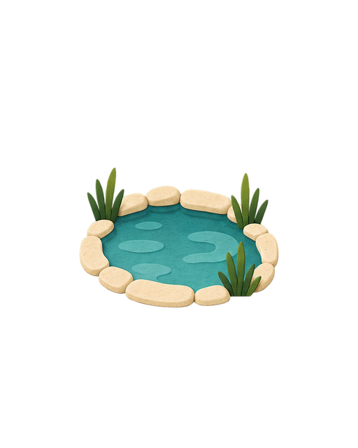                            | `src/content/willow-reach.json`, `art/incoming/` |
| Greenhouse              | `greenhouse`            | Food     | Any land                            | Glass; evolves into Winter Garden.                                                 | 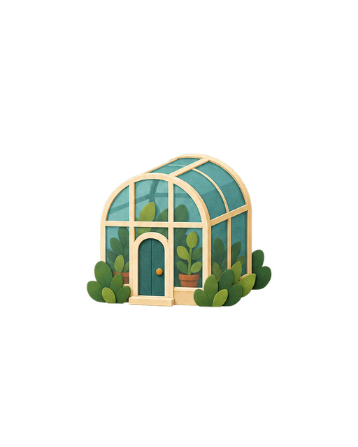                         | `src/content/willow-reach.json`, `art/incoming/` |
| Composter               | `composter`             | Industry | Any land                            | Steaming heap.                                                                     | 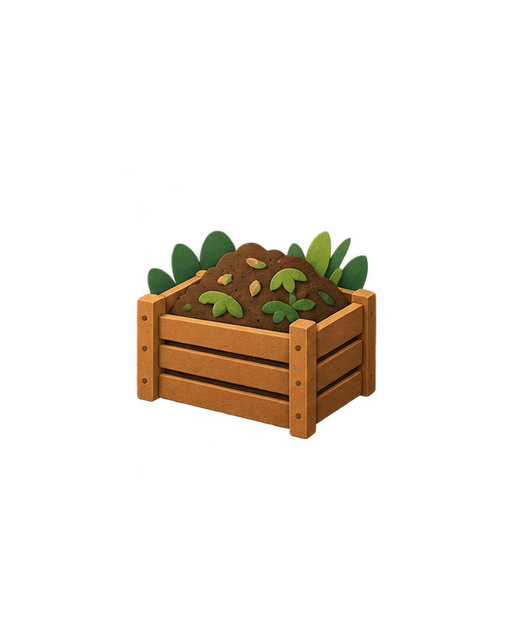                           | `src/content/willow-reach.json`, `art/incoming/` |
| Salvage Yard            | `salvageYard`           | Industry | Ruin                                | Only on ruins; evolves into Rewilded Ruin.                                         | 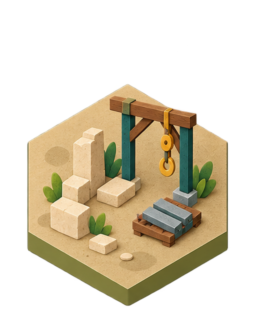                      | `src/content/willow-reach.json`, `art/incoming/` |
| Workshop                | `workshop`              | Industry | Any land                            | Smoke from the chimney when it runs (code): show where the chimney is.             | 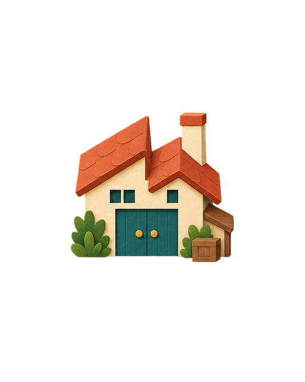                             | `src/content/willow-reach.json`, `art/incoming/` |
| Kiln                    | `kiln`                  | Industry | Any land                            | Tall (casts shade). Smoke when it runs.                                            | 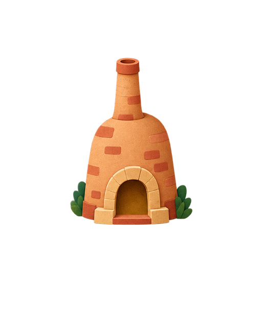                                     | `src/content/willow-reach.json`, `art/incoming/` |
| Cottage                 | `cottage`               | Home     | Any land                            | Home: lit windows at night (optional lit layer). Evolves into Treehouse Commons.   | 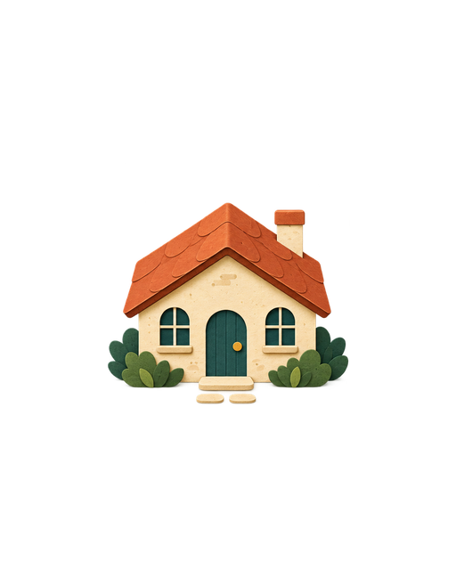                               | `src/content/willow-reach.json`, `art/incoming/` |
| Commons Plaza           | `commonsPlaza`          | Civic    | Any land                            | Civic; an open plaza.                                                              | 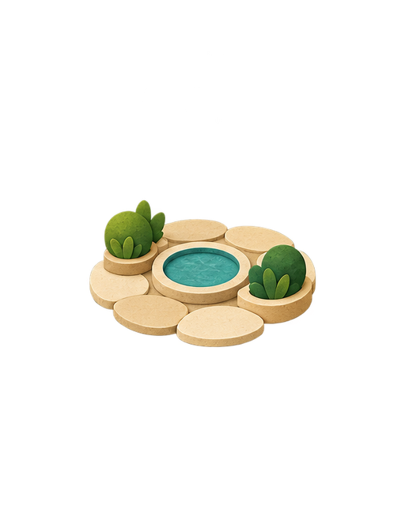                    | `src/content/willow-reach.json`, `art/incoming/` |
| Cider Press             | `ciderPress`            | Civic    | Any land                            | Civic; barrels and apples.                                                         | 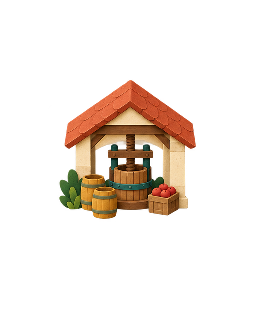                        | `src/content/willow-reach.json`, `art/incoming/` |
| Seedbank Library        | `seedbankLibrary`       | Civic    | Any land                            | Tall (casts shade). Civic.                                                         | 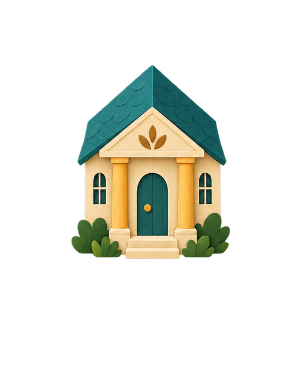              | `src/content/willow-reach.json`, `art/incoming/` |
| Tree Nursery            | `treeNursery`           | Nature   | Any land                            | Saplings in rows; improves the land.                                               | 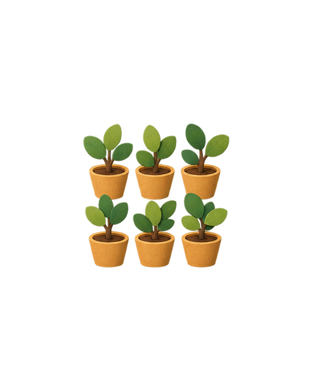                      | `src/content/willow-reach.json`, `art/incoming/` |
| Pollinator Meadow       | `pollinatorMeadow`      | Nature   | Barren, Scrub, Meadow, Woodland     | Ground cover: flowers across the footprint; butterflies (code).                    | 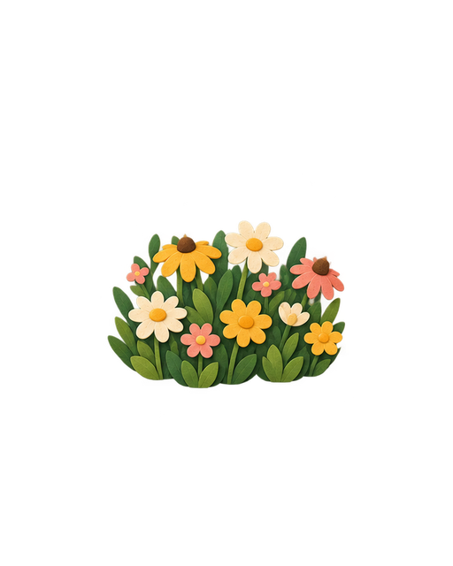            | `src/content/willow-reach.json`, `art/incoming/` |
| Weir                    | `weir`                  | Water    | River                               | Only on river: spans the water.                                                    | 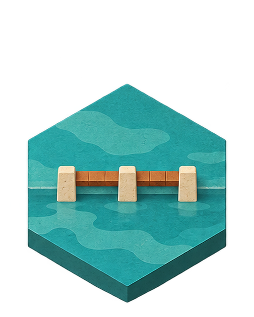                                     | `src/content/willow-reach.json`, `art/incoming/` |
| Levee                   | `levee`                 | Water    | Any land                            | An earth bank; protects floodplain nearby.                                         | 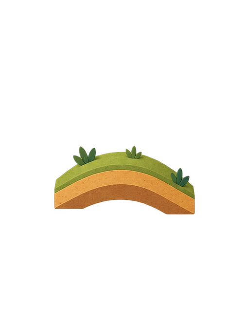                                   | `src/content/willow-reach.json`, `art/incoming/` |
| Solar Canopy            | `solarCanopy`           | Energy   | Any land                            | Panels on posts; dimmed by shade.                                                  | 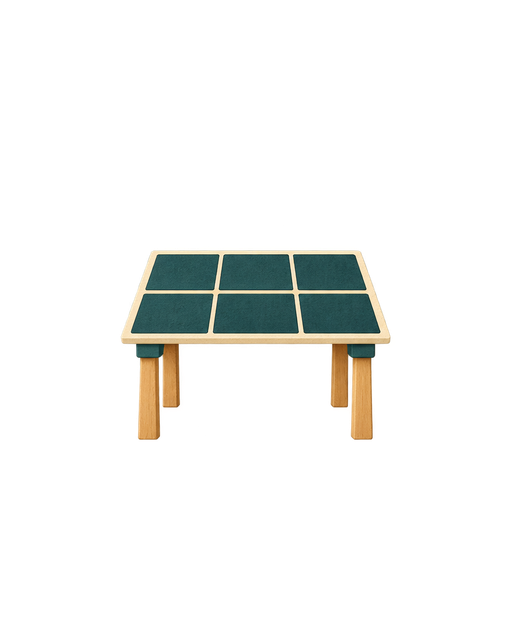                      | `src/content/willow-reach.json`, `art/incoming/` |
| River Wheel             | `riverWheel`            | Energy   | Any land, beside river or reservoir | Beside the river. Moving part: the wheel.                                          | 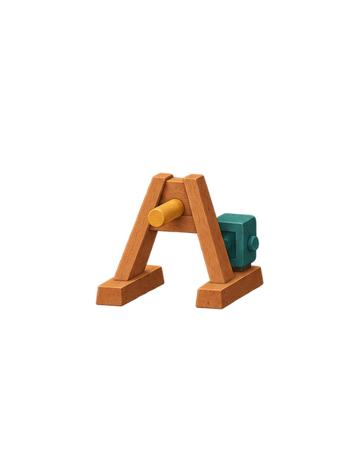                        | `src/content/willow-reach.json`, `art/incoming/` |
| Wind Spire              | `windSpire`             | Energy   | Hill                                | Only on hills; tall. Moving part: the blades.                                      | 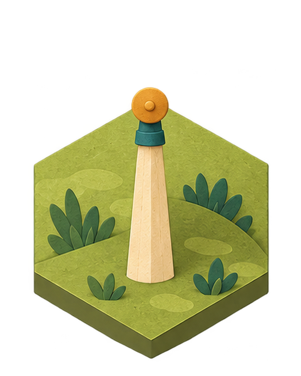                          | `src/content/willow-reach.json`, `art/incoming/` |
| Biogas Digester         | `biogasDigester`        | Energy   | Any land                            | A dome.                                                                            | 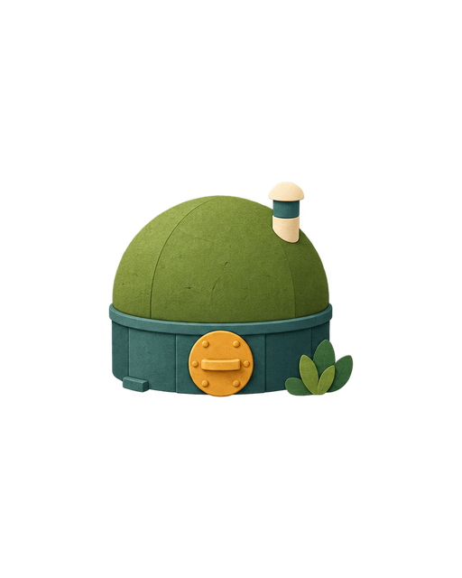                | `src/content/willow-reach.json`, `art/incoming/` |
| Heat Pump               | `heatPump`              | Energy   | Any land                            | Small unit.                                                                        | 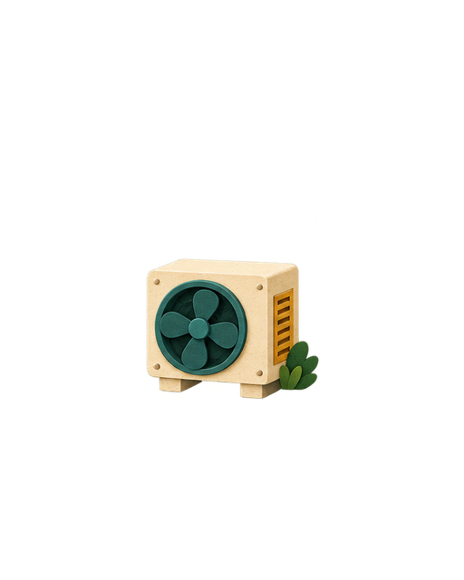                            | `src/content/willow-reach.json`, `art/incoming/` |
| Solar Thermal Collector | `solarThermalCollector` | Energy   | Any land                            | Warm-coloured panels, unlike Solar Canopy’s teal.                                  | 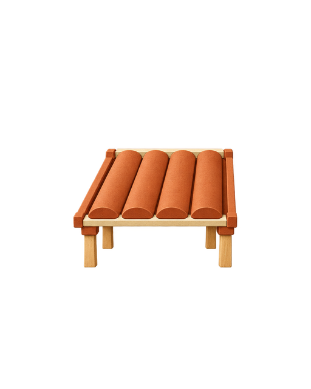 | `src/content/willow-reach.json`, `art/incoming/` |
| Cell Bank               | `cellBank`              | Storage  | Any land                            | Battery block.                                                                     | 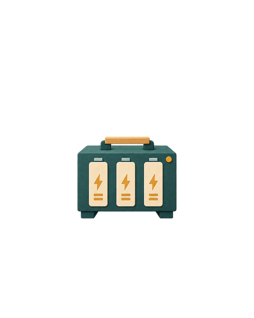                            | `src/content/willow-reach.json`, `art/incoming/` |
| Heat Well               | `heatWell`              | Storage  | Any land                            | An insulated pit with a warm glow.                                                 | 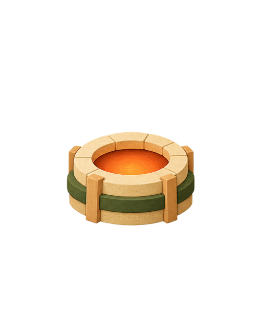                            | `src/content/willow-reach.json`, `art/incoming/` |
| Pumped Reservoir        | `pumpedReservoir`       | Storage  | Hill                                | Only on hills: a raised basin of water.                                            | 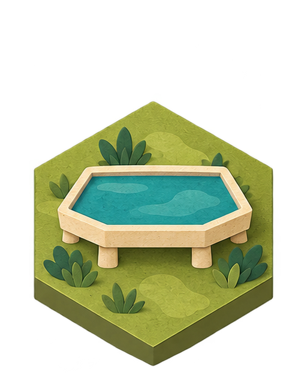              | `src/content/willow-reach.json`, `art/incoming/` |
| Winter Garden           | `winterGarden`          | Food     | Any land                            | Evolved from Greenhouse: keep its outline, add blossom.                            | 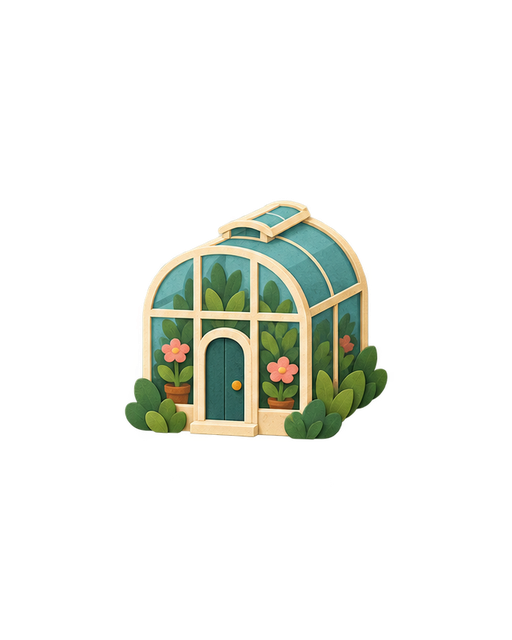                    | `src/content/willow-reach.json`, `art/incoming/` |
| Agrivoltaic Field       | `agrivoltaicField`      | Food     | Floodplain, Meadow                  | Evolved from Floodplain Farm + Solar Canopy: field under raised panels.            | 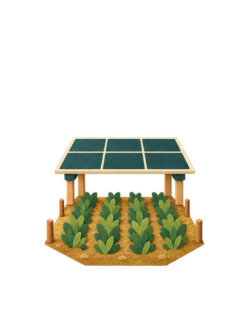            | `src/content/willow-reach.json`, `art/incoming/` |
| Rewilded Ruin           | `rewildedRuin`          | Nature   | Ruin                                | Evolved from Salvage Yard: ruin overgrown.                                         | 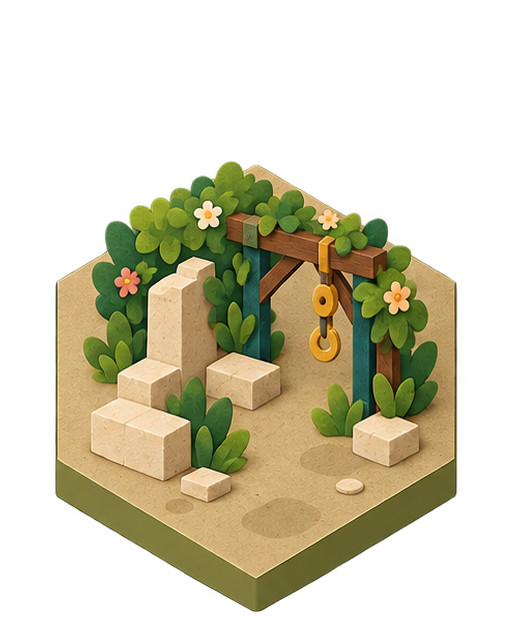                    | `src/content/willow-reach.json`, `art/incoming/` |
| Treehouse Commons       | `treehouseCommons`      | Home     | Any land                            | Evolved from Cottage beside woodland: home in a tree. Lit at night.                | 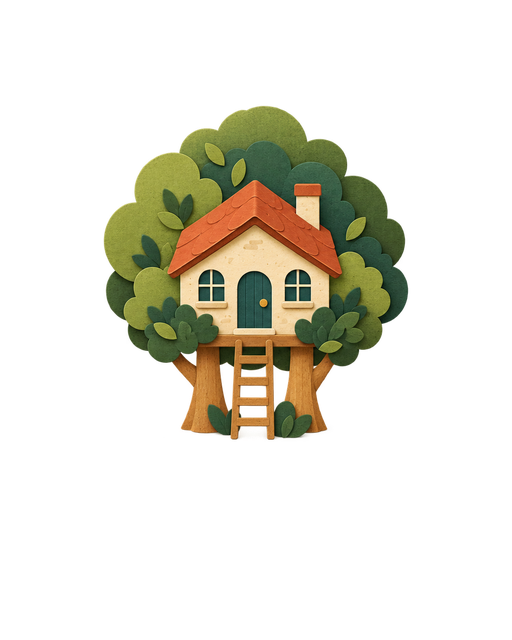            | `src/content/willow-reach.json`, `art/incoming/` |

Root City's districts and landmarks are drawn separately (SVG in `src/ui/City.tsx`) and are not
covered here.
