# Art guide

How to make art that can replace Sunroot's procedural drawings, tile by tile and building by
building. Everything the game draws now is exported as images to draw over:
`npx tsx scripts/export-art.ts` writes them to [`art/current/`](art/current/) (one PNG per tile
and building, each building also shown on a tile, and [a contact sheet](art/current/sheet.png)).
[`art/template.png`](art/template.png) is the frame every image is delivered in.

The design doc calls for procedural art "until the slice is fun"
([DESIGN.md](DESIGN.md), Working rules) and leaves "when to commission hand-made art" open. Hand-made
art is now being drawn, so: each image delivered replaces the procedural drawing for that one id,
and anything not delivered keeps its procedural drawing. The game always runs without art files,
and tests never depend on them.

## Style

- **Sunlit papercraft, as a diorama.** The world is cut paper ([DESIGN.md](DESIGN.md), Look,
  feel and sound): flat, matte shapes in layers. The 3D element is the layering: give each layer a
  paper thickness (a darker edge 2 to 6 px at delivery size), let layers stand up from the tile
  like a pop-up book, and shade with soft contact shadows where layers meet. No glossy
  highlights, no hard black outlines, no photographic texture. A faint paper grain is welcome.
- **Light from the upper left**, soft and high (late morning). Bake only contact shadows and
  shading on the object itself. Don't bake long cast shadows across the tile: the game draws
  moving shadows as the sun crosses each season, and shade is a rule (tall buildings dim solar).
- **Neutral season.** Draw late spring to summer. The game repaints the seasons over the art
  (blossom, autumn leaves, snow, a colour wash). Season-specific versions are optional (see
  Files).
- **Readable small.** The map zooms from half to 2.5 times game size, so a tile can be as small as
  25 px across. Each building needs a silhouette and main colour of its own at that size;
  details under 4 px at delivery size disappear. The interface also shows each building as a
  48 px icon.
- **Evolutions echo their origin.** Each evolved building should be recognisably the building it
  came from, changed (see the table).
- **Colour.** Stay near the palette below so new and old art sit together during the change-over.
  Don't carry meaning by colour alone.

| Swatch            | Hex                   | Used for                               | Source                  |
| ----------------- | --------------------- | -------------------------------------- | ----------------------- |
| Paper             | `#f4ebd6`             | Background, the gaps between tiles     | `src/render/palette.ts` |
| Ink               | `#2f3b2e`             | Dark details, shadows (at low opacity) | `src/render/palette.ts` |
| Sun gold          | `#f2c14e`             | Light, highlights, flags               | `src/render/palette.ts` |
| Leading gold      | `#d9a441`             | Gold edges                             | `src/render/palette.ts` |
| Terracotta        | `#d98c5f`             | Roofs                                  | `src/render/palette.ts` |
| Wall              | `#f3dfbd`             | Walls                                  | `src/render/palette.ts` |
| Wood              | `#a0643f`             | Timber, trunks                         | `src/render/palette.ts` |
| Stone             | `#9e9280`             | Stone, ruins                           | `src/render/palette.ts` |
| Tree dark / light | `#4a6e43` / `#5e8a55` | Foliage                                | `src/render/palette.ts` |
| Solar teal        | `#2f5e63`             | Solar panels                           | `src/render/palette.ts` |
| Water             | `#9ccfc9`             | Ponds                                  | `src/render/palette.ts` |
| Field / furrow    | `#e6cf73` / `#b89b3e` | Crops                                  | `src/render/palette.ts` |
| Fruit / flower    | `#d9543c` / `#e58fa8` | Fruit, flowers                         | `src/render/palette.ts` |

Each tile type's top and side colours are in `TILE_COLORS` in the same file.

## Geometry

The map is a grid of pointy-top hexes seen from above. The hex's top face is a **regular
hexagon**, not squashed; depth shows as a band of the tile's side below it, and things with height
rise straight up the screen. That is the projection to draw in (an oblique, "top-down with front
faces" view): you see tops and south-facing fronts, never the north or the sides.

Every image is delivered in the same frame, so it can be placed without any measuring:

| Measure                                    | Delivery size (4×)             | In the game (1×) | Source                   |
| ------------------------------------------ | ------------------------------ | ---------------- | ------------------------ |
| Frame                                      | 256 × 384 px                   | 64 × 96          | `src/render/artSheet.ts` |
| Tile centre (the anchor)                   | (128, 240)                     | (32, 60)         | `src/render/artSheet.ts` |
| Hex top face, centre to corner             | 116 px (201 px wide, 232 tall) | 29               | `src/render/layout.ts`   |
| Tile side, below the top face              | 18 px                          | 4.5              | `src/render/layout.ts`   |
| Building footprint (base stays inside)     | hex of 88 px centre to corner  | 22               | `src/render/artSheet.ts` |
| Usual building top                         | y 120 (120 px above centre)    | 30 above centre  | `src/render/artSheet.ts` |
| Tall buildings (kiln, library, wind spire) | up to y 0                      | 60 above centre  | `src/render/artSheet.ts` |

Neighbouring tiles touch, with a 1 px paper gap the game draws. Buildings are drawn back to front,
so anything rising above the footprint overlaps the tile behind, as it should.

**If you render from a 3D tool** with a tilted camera, the hexes come out squashed vertically. That
works too, but tell me the camera's tilt first: the game's grid then has to be squashed to match
(one setting), and every image must use the same tilt. For hand-drawn or 2.5D art, keep the
regular hexagon above.

## Files

- **PNG, 32-bit with transparency, sRGB**, 256 × 384, the full frame (not trimmed). Check edges on
  dark and light backgrounds for halos.
- **Names are the ids** in the tables, exactly (camelCase): `tiles/meadow.png`,
  `buildings/windSpire.png`.
- **Tiles** include their top face and side band, on transparency outside the hexagon. Up to three
  variants per type (`meadow.png`, `meadow-2.png`, `meadow-3.png`); the game will pick one per tile,
  the same every time. River and reservoir must join seamlessly with themselves on every edge
  (no banks): the game draws the current line through them.
- **Buildings** come without the tile underneath, on transparency, including their own contact
  shadow. Ground covers (farm, agrivoltaic field, fish pond, pollinator meadow, pumped reservoir,
  levee, weir) may fill the whole footprint.
- **Optional layers**, in the same frame and position:
  - `<id>.lit.png`: glowing windows, shown at night on homes (Founders' Camp, Cottage, Treehouse
    Commons).
  - `<id>.rotor.png`: the part that turns (Wind Spire blades, River Wheel wheel), drawn in place;
    note the pixel of its hub.
  - `<tile or id>.winter.png` (or spring, autumn): a season of its own, used instead of the
    painted-over default.
- **What the game draws over the art, so leave it out:** smoke, bees, butterflies, fish and other
  life; silt, damage and blackout veils; the map marks and highlights; the placement ghost (the
  same art, faded); seasonal blossom, leaves and snow; night.
- Put finished files in `public/art/tiles/` and `public/art/buildings/` (or send them as a zip).
  A partial set is fine.

## Tile types

| Tile       | Id           | What it is in play                                                                                          | Current art                                                              | Source                                               |
| ---------- | ------------ | ----------------------------------------------------------------------------------------------------------- | ------------------------------------------------------------------------ | ---------------------------------------------------- |
| River      | `river`      | Water. Weirs go on it; river wheels go beside it. Floods spread from it. The current line is drawn by code. | 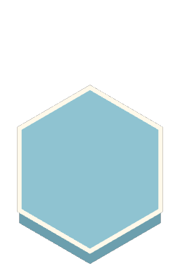           | `src/sim/content/schema.ts`, `src/render/tileArt.ts` |
| Reservoir  | `reservoir`  | Still water a weir backs up (3 tiles upstream). Turns back into river if the weir goes.                     | 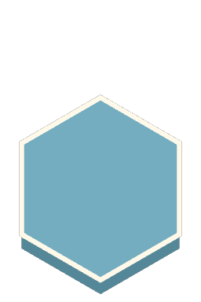   | `src/sim/content/schema.ts`, `src/render/tileArt.ts` |
| Floodplain | `floodplain` | Fertile, floods in spring. Farms gain silt; other buildings get damaged unless a levee is near.             | 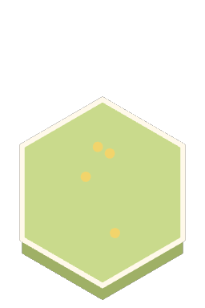 | `src/sim/content/schema.ts`, `src/render/tileArt.ts` |
| Hill       | `hill`       | Wind spires and pumped reservoirs go here. Buildings on hills are exposed to storms.                        | 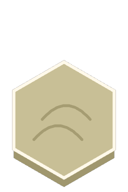             | `src/sim/content/schema.ts`, `src/render/tileArt.ts` |
| Ruin       | `ruin`       | Old town remains holding salvage. Salvage yards go here.                                                    | 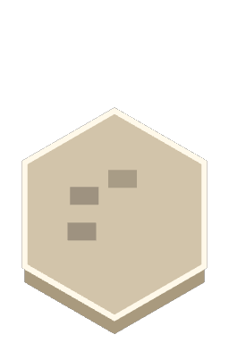             | `src/sim/content/schema.ts`, `src/render/tileArt.ts` |
| Barren     | `barren`     | Worn-out land; bottom of the healing ladder.                                                                | 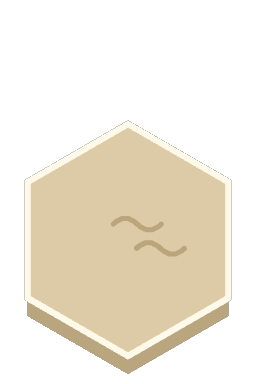         | `src/sim/content/schema.ts`, `src/render/tileArt.ts` |
| Scrub      | `scrub`      | Recovering land; second step of the healing ladder.                                                         | 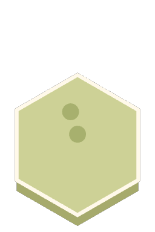           | `src/sim/content/schema.ts`, `src/render/tileArt.ts` |
| Meadow     | `meadow`     | Healthy land; third step. Adds Harmony.                                                                     | 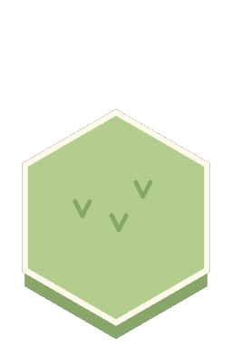         | `src/sim/content/schema.ts`, `src/render/tileArt.ts` |
| Woodland   | `woodland`   | Healthiest land; top step. Casts shade; shelters buildings from storms.                                     | 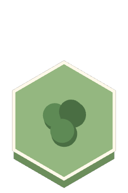     | `src/sim/content/schema.ts`, `src/render/tileArt.ts` |

Healing ladder: barren → scrub → meadow → woodland. Tiles step up it as the land heals, so these
four should read as one land getting healthier.

## Buildings

| Building                | Id                      | Kind     | Placed on                           | Art notes                                                                          | Current art                                                                                           | Source                                                       |
| ----------------------- | ----------------------- | -------- | ----------------------------------- | ---------------------------------------------------------------------------------- | ----------------------------------------------------------------------------------------------------- | ------------------------------------------------------------ |
| Founders' Camp          | `foundersCamp`          | Home     | Land except floodplain              | Where every run starts; a camp with a flag. Lit at night.                          | 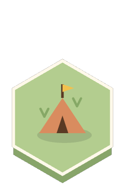                   | `src/content/willow-reach.json`, `src/render/buildingArt.ts` |
| Floodplain Farm         | `floodplainFarm`        | Food     | Floodplain, Meadow                  | Ground cover: fills the footprint. Survives floods; silt is drawn over it by code. |                 | `src/content/willow-reach.json`, `src/render/buildingArt.ts` |
| Orchard                 | `orchard`               | Food     | Land except floodplain              | Fruit trees; takes seasons to mature.                                              | 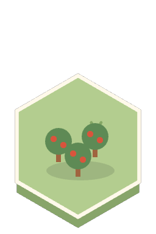                               | `src/content/willow-reach.json`, `src/render/buildingArt.ts` |
| Apiary                  | `apiary`                | Food     | Any land                            | Hives; bees are animated by code.                                                  | 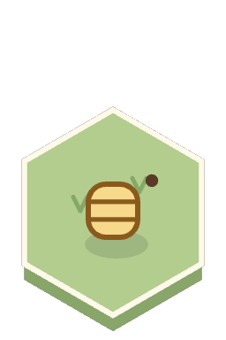                                 | `src/content/willow-reach.json`, `src/render/buildingArt.ts` |
| Fish Pond               | `fishPond`              | Food     | Any land                            | Ground cover: water fills most of the footprint; fish leap (code).                 | 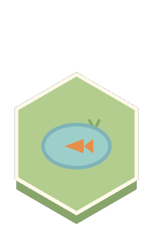                            | `src/content/willow-reach.json`, `src/render/buildingArt.ts` |
| Greenhouse              | `greenhouse`            | Food     | Any land                            | Glass; evolves into Winter Garden.                                                 |                          | `src/content/willow-reach.json`, `src/render/buildingArt.ts` |
| Composter               | `composter`             | Industry | Any land                            | Steaming heap.                                                                     | 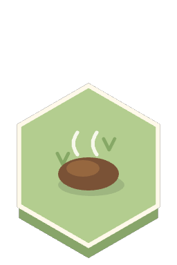                           | `src/content/willow-reach.json`, `src/render/buildingArt.ts` |
| Salvage Yard            | `salvageYard`           | Industry | Ruin                                | Only on ruins; evolves into Rewilded Ruin.                                         | 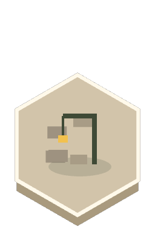                      | `src/content/willow-reach.json`, `src/render/buildingArt.ts` |
| Workshop                | `workshop`              | Industry | Any land                            | Smoke from the chimney when it runs (code): show where the chimney is.             | 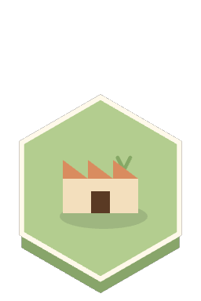                             | `src/content/willow-reach.json`, `src/render/buildingArt.ts` |
| Kiln                    | `kiln`                  | Industry | Any land                            | Tall (casts shade). Smoke when it runs.                                            | 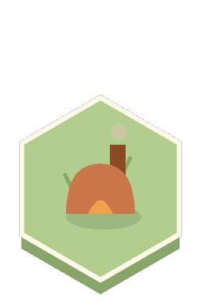                                     | `src/content/willow-reach.json`, `src/render/buildingArt.ts` |
| Cottage                 | `cottage`               | Home     | Any land                            | Home: lit windows at night (optional lit layer). Evolves into Treehouse Commons.   | 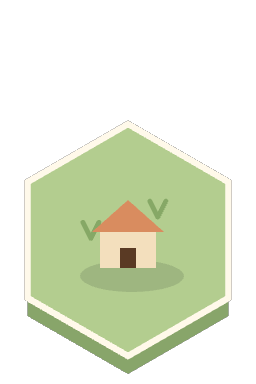                               | `src/content/willow-reach.json`, `src/render/buildingArt.ts` |
| Commons Plaza           | `commonsPlaza`          | Civic    | Any land                            | Civic; an open plaza.                                                              | 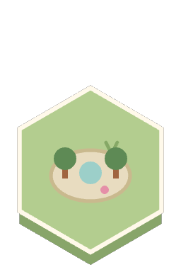                    | `src/content/willow-reach.json`, `src/render/buildingArt.ts` |
| Cider Press             | `ciderPress`            | Civic    | Any land                            | Civic; barrels and apples.                                                         | 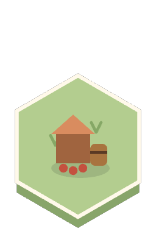                        | `src/content/willow-reach.json`, `src/render/buildingArt.ts` |
| Seedbank Library        | `seedbankLibrary`       | Civic    | Any land                            | Tall (casts shade). Civic.                                                         |               | `src/content/willow-reach.json`, `src/render/buildingArt.ts` |
| Tree Nursery            | `treeNursery`           | Nature   | Any land                            | Saplings in rows; improves the land.                                               | 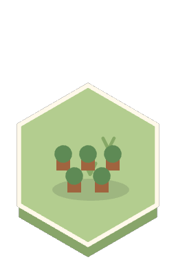                      | `src/content/willow-reach.json`, `src/render/buildingArt.ts` |
| Pollinator Meadow       | `pollinatorMeadow`      | Nature   | Barren, Scrub, Meadow, Woodland     | Ground cover: flowers across the footprint; butterflies (code).                    | 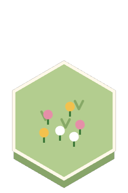            | `src/content/willow-reach.json`, `src/render/buildingArt.ts` |
| Weir                    | `weir`                  | Water    | River                               | Only on river: spans the water.                                                    | 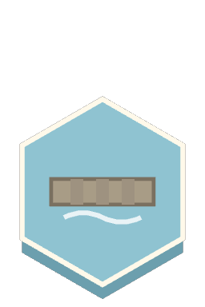                                     | `src/content/willow-reach.json`, `src/render/buildingArt.ts` |
| Levee                   | `levee`                 | Water    | Any land                            | An earth bank; protects floodplain nearby.                                         | 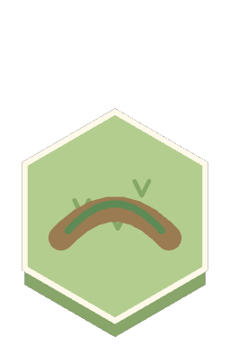                                   | `src/content/willow-reach.json`, `src/render/buildingArt.ts` |
| Solar Canopy            | `solarCanopy`           | Energy   | Any land                            | Panels on posts; dimmed by shade.                                                  | 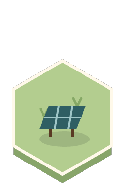                      | `src/content/willow-reach.json`, `src/render/buildingArt.ts` |
| River Wheel             | `riverWheel`            | Energy   | Any land, beside river or reservoir | Beside the river. Moving part: the wheel.                                          | 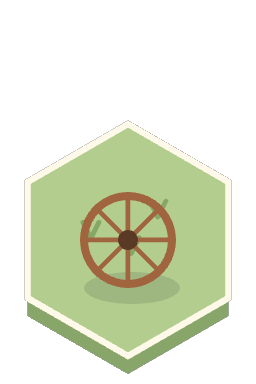                        | `src/content/willow-reach.json`, `src/render/buildingArt.ts` |
| Wind Spire              | `windSpire`             | Energy   | Hill                                | Only on hills; tall. Moving part: the blades.                                      | 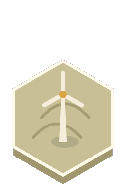                          | `src/content/willow-reach.json`, `src/render/buildingArt.ts` |
| Biogas Digester         | `biogasDigester`        | Energy   | Any land                            | A dome.                                                                            | 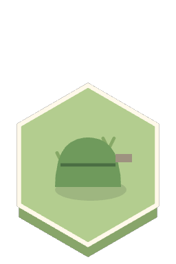                | `src/content/willow-reach.json`, `src/render/buildingArt.ts` |
| Heat Pump               | `heatPump`              | Energy   | Any land                            | Small unit.                                                                        |                             | `src/content/willow-reach.json`, `src/render/buildingArt.ts` |
| Solar Thermal Collector | `solarThermalCollector` | Energy   | Any land                            | Warm-coloured panels, unlike Solar Canopy’s teal.                                  | 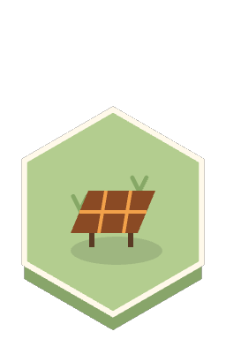 | `src/content/willow-reach.json`, `src/render/buildingArt.ts` |
| Cell Bank               | `cellBank`              | Storage  | Any land                            | Battery block.                                                                     | 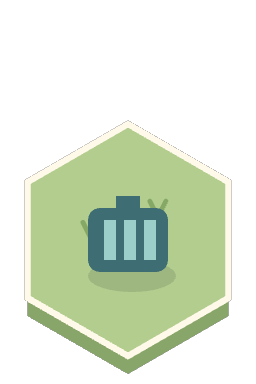                            | `src/content/willow-reach.json`, `src/render/buildingArt.ts` |
| Heat Well               | `heatWell`              | Storage  | Any land                            | An insulated pit with a warm glow.                                                 | 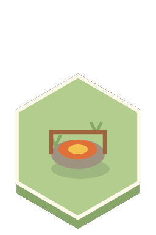                            | `src/content/willow-reach.json`, `src/render/buildingArt.ts` |
| Pumped Reservoir        | `pumpedReservoir`       | Storage  | Hill                                | Only on hills: a raised basin of water.                                            | 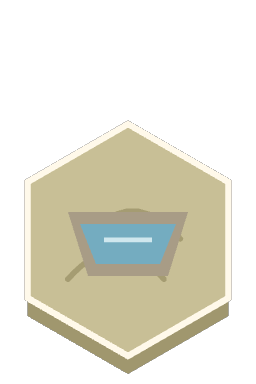              | `src/content/willow-reach.json`, `src/render/buildingArt.ts` |
| Winter Garden           | `winterGarden`          | Food     | Any land                            | Evolved from Greenhouse: keep its outline, add blossom.                            | 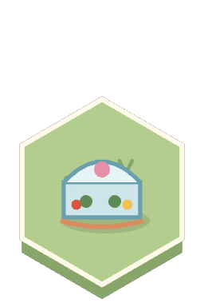                    | `src/content/willow-reach.json`, `src/render/buildingArt.ts` |
| Agrivoltaic Field       | `agrivoltaicField`      | Food     | Floodplain, Meadow                  | Evolved from Floodplain Farm + Solar Canopy: field under raised panels.            | 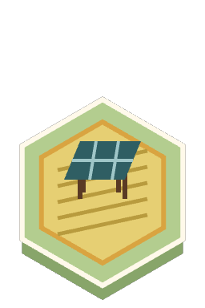            | `src/content/willow-reach.json`, `src/render/buildingArt.ts` |
| Rewilded Ruin           | `rewildedRuin`          | Nature   | Ruin                                | Evolved from Salvage Yard: ruin overgrown.                                         | 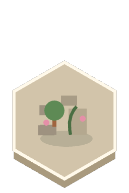                    | `src/content/willow-reach.json`, `src/render/buildingArt.ts` |
| Treehouse Commons       | `treehouseCommons`      | Home     | Any land                            | Evolved from Cottage beside woodland: home in a tree. Lit at night.                | 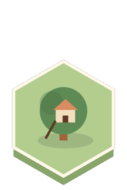            | `src/content/willow-reach.json`, `src/render/buildingArt.ts` |

Root City's districts and landmarks are drawn separately (SVG in `src/ui/City.tsx`) and are not
covered here.

## Turning art into the game

When files arrive: a loader reads `public/art/`, replaces the procedural drawing for each id
found, keeps it for the rest, and the icons, ghost and inspector follow automatically. I check
each against this guide (frame, anchor, footprint, names), compare it with the procedural version
at every zoom and season, and note anything that needs a change.
